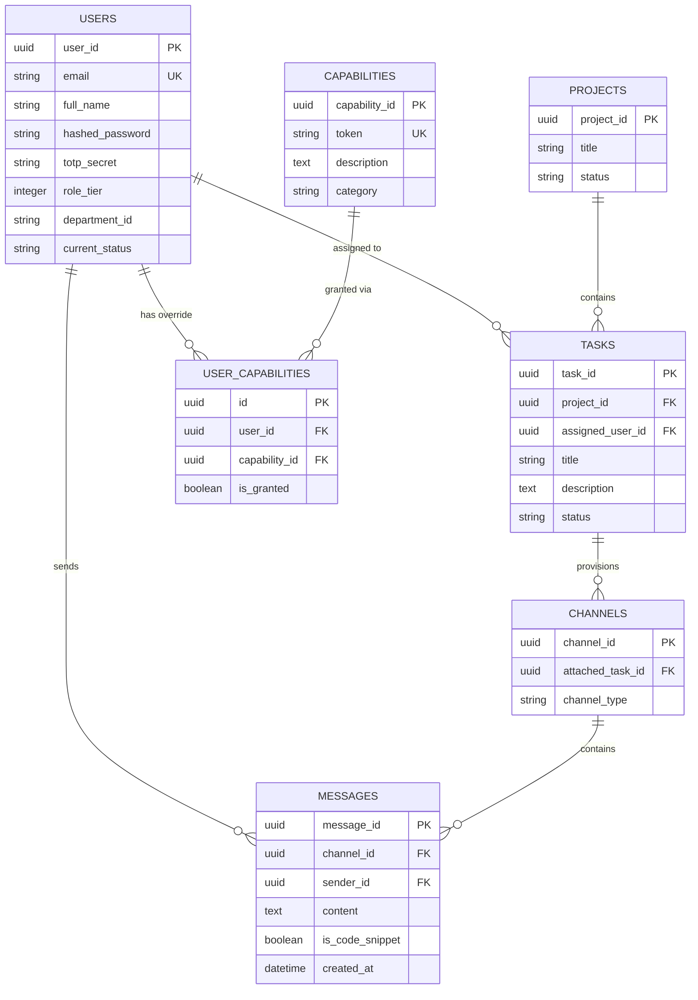

# Product Requirements Document (PRD): SEVEN Workspace Ecosystem

## 1. Document Overview
* **Project Name:** SEVEN Workspace Ecosystem
* **Author:** AI Coding Assistant (Antigravity)
* **Date:** June 5, 2026
* **Status:** Draft / Handover Ready
* **Target Audience:** Product Managers, Technical Leads, System Administrators, Incoming Developers

---

## 2. Product Description
**SEVEN** is a high-security, role-based, real-time collaboration and task-management suite. It is designed to model strict operational hierarchies typical in mission-critical development teams, aerospace organizations, or high-security intelligence squads.

Unlike standard tools (e.g., Jira, Slack, Trello) which rely on flat permissions or broad project-level groups, SEVEN introduces **Hierarchical Role Tiers (Tiers 1–4)** combined with a **Granular Capability-Override System**. It merges communication and action by attaching dedicated real-time chat channels directly to individual tasks, and coordinates emergency work blockages through a system-wide **Blocker Beacon**.

### Core Value Propositions:
1. **Context-Attached Communication:** No separate chat spaces; every message lives within the context of a specific task.
2. **Strict Hierarchy with Granular Overrides:** Base permissions are inherited from the user's Role Tier, but administrators can explicitly grant or revoke individual system capabilities.
3. **High-Visibility Emergency Protocols:** Systems like the Blocker Beacon ensure workspace obstacles are visual, auditory (via micro-animations and UI alerts), and cannot be dismissed without authorization.
4. **Security-First Administration:** Master Admin accounts require Time-Based One-Time Password (TOTP) Multi-Factor Authentication (MFA) to initialize and access system administration features.

---

## 3. User Personas & Role Tiers

The SEVEN workspace is divided into four strict levels of operational authority:

| Tier | Role Title | Description & Typical Persona | Default System Capabilities |
| :--- | :--- | :--- | :--- |
| **Tier 1** | **Executive Admin** | Top-level organizational leaders (e.g., CTO, Director of Security). They require a global view of task velocity, system health, and absolute administrative authority. | Master control, user creation/management, capability override assignment, strategy matrix access, and sending workspace-wide system broadcasts. |
| **Tier 2** | **Directional** | Product owners, program managers, or department heads. They focus on project scoping, milestones, and resource mapping. | Can define projects/squads, inspect the Strategy Matrix, and view all tasks. |
| **Tier 3** | **Leadership** | Engineering leads, scrum masters, or technical leads. They manage day-to-day execution, assign tasks, and override blockers. | Task assignment, status modifications, and the capability to override/resolve Blocked states. |
| **Tier 4** | **Execution** | Developers, QA analysts, design experts, and engineers. They work directly on code, assets, or systems. | View own developer dashboard, modify task status (e.g., move from Assigned to In Progress, or trigger Blocker Beacons when stuck). Cannot resolve blockers or modify user permissions. |

---

## 4. Key Functional Features

```
+----------------------------------------------------------------------------+
|                            SEVEN Workspace UI                              |
+----------------------------------------------------------------------------+
|  [Sidebar]         [Main Panel]                                            |
|   - Dashboard       +---------------------------------------------------+  |
|   - Squads/Proj     |  System Broadcast Banner (Tier 1 Admin sent)      |  |
|   - Strategy        +---------------------------------------------------+  |
|   - Admin Portal    |  Task Board (Kanban-Style Status Flow)            |  |
|                     |  [Backlog] -> [Assigned] -> [In Progress] ->      |  |
|   [Active User]     |  [Blocked] (*Triggers Blocker Beacon Overlay*)    |  |
|   Name (Tier 1-4)   +---------------------------------------------------+  |
|   Status: Active    |  Contextual Task Chat                             |  |
|   [Terminate Link]  |  - (Real-time WebSockets, Code Snippet toggle)    |  |
+---------------------+---------------------------------------------------+  |
```

### Feature 4.1: Authentication & Two-Factor Enrollment (TOTP)
* **Description:** A secure, password-hashed authentication layer verified by JWT tokens.
* **Requirements:**
  * User passwords must be securely hashed using `bcrypt`.
  * Tier 1 Executive Admin setup is CLI-driven (`create_admin.py`) and generates a TOTP secret. It displays a command-line ASCII QR code for Google Authenticator (or comparable authenticator apps) and requires entering a valid 6-digit code to finalize enrollment.
  * API endpoints check the TOTP code on login if `totp_secret` is present in the database.

### Feature 4.2: Task Board & Real-Time Flow
* **Description:** Interactive Kanban board tracking task progression through predefined states.
* **Task Status Life Cycle:**
  `Backlog` ➔ `Assigned` ➔ `In Progress` ➔ `Blocked` / `Review` ➔ `QA` ➔ `Deployed` ➔ `Done`
* **Requirements:**
  * Creating a task broadcasts the event to all active clients via WebSockets, rendering it dynamically without page refresh.
  * Assigning a task links the task to a specific User Profile and broadcasts the updated metadata.
  * Only users with the `dev:override_blocker` capability (Tiers 1-3 by default) can change a task's status out of the `Blocked` state.

### Feature 4.3: Blocker Beacon Alert Protocol
* **Description:** An immediate, high-priority emergency mechanism triggered when a task's status is changed to `Blocked`.
* **Requirements:**
  * When a developer changes their task status to `Blocked`, the backend automatically:
    1. Sets the developer's status to `Blocked`.
    2. Broadcasts a `blocker_beacon` message over WebSockets.
  * Active frontend clients immediately display an emergency alert overlay showing the task title, assignee name, and the alert message.
  * Sound effects or visual micro-animations (e.g., glowing red headers) warn the team of the blocker.

### Feature 4.4: Contextual Task-Attached Chat
* **Description:** Every task created automatically provisions a communication `Channel` in the database.
* **Requirements:**
  * When a user opens a task's details panel, the frontend fetches the associated channel messages.
  * Users can send text or toggle an `Is Code Snippet` switch (which formats the message in a monospaced block with syntax styling).
  * Chat messages are pushed in real time via WebSockets to all users viewing that channel.

### Feature 4.5: Granular Capability Overrides
* **Description:** Overrules standard role inheritance. An administrator can explicitly grant or revoke a capability for a single developer.
* **System Capability Tokens:**
  * `dev:override_blocker`: Can resolve or clear active blocker beacons.
  * `admin:manage_users`: Can create/provision new users or delete users.
  * `strategy:view_matrix`: Can view top-level strategy guidelines.
* **Requirements:**
  * The Master Admin Dashboard contains an "Admin Override Drawer" displaying a grid of users and their override states.
  * The admin can click toggle switches to:
    * Explicitly **Revoke** (Forced False): E.g., Revoking blocker override permissions from a Lead Developer.
    * Explicitly **Grant** (Forced True): E.g., Granting strategy matrix view access to an Execution developer.
    * **Reset Override**: Fallback to base Role Tier permissions.

### Feature 4.6: Targeted System Broadcasts
* **Description:** High-priority, real-time message alerts dispatched by Tier 1 Admins.
* **Requirements:**
  * Admins fill out a broadcast form specifying a message and an optional target capability (e.g., `strategy:view_matrix`).
  * If a target capability is specified, only clients possessing that capability (either through role tier or explicit override) will display the system alert overlay. Other users remain unaffected.

---

## 5. Non-Functional Requirements

### 5.1 Security
* **Authentication Tokens:** JSON Web Tokens (JWT) signed with a secure HS256 algorithm and stored in the browser's `localStorage` for session maintenance.
* **API Protection:** Backend REST routes and WebSocket handlers check JWT authorizations. Role-based routes check user tier or explicit user capabilities before execution.

### 5.2 Performance & Reliability
* **Real-time updates:** WebSockets must handle rapid status updates, message delivery, and alerts with latency under 100ms.
* **State synchronization:** The Zustand store must coordinate local frontend state with backend SQLite database updates smoothly.

### 5.3 User Experience & Design
* **Theme:** Retro-cyberpunk terminal theme with absolute dark backdrops (`#000000`, `#050505`), neon highlights (Cyan `#00E5FF`, Red `#ff1744`, Emerald `#10b981`), and monospaced typography (e.g., Geist Mono / Roboto Mono).
* **Interactions:** Subtle glow effects on hover, sliding transition drawers, pulse animations on active alerts, and immediate state updates.

---

## 6. Database Schema Design (Production & Local)



### 6.1 Logical Schema Definitions

#### Users Table (`users`)
* `user_id`: UUID (Primary Key)
* `email`: VARCHAR(255) (Unique, Index)
* `full_name`: VARCHAR(255)
* `hashed_password`: VARCHAR(255)
* `totp_secret`: VARCHAR(255) (Nullable)
* `role_tier`: INTEGER (1 to 4)
* `department_id`: VARCHAR(255) (Nullable, maps to department code)
* `current_status`: VARCHAR(50) (Default: 'Active', values: 'Active', 'Deep Work', 'Blocked', 'Offline')

#### Projects Table (`projects`)
* `project_id`: UUID (Primary Key)
* `title`: VARCHAR(255)
* `status`: VARCHAR(50) (Default: 'Active')

#### Tasks Table (`tasks`)
* `task_id`: UUID (Primary Key)
* `project_id`: UUID (Foreign Key, references `projects.project_id`, Cascade)
* `assigned_user_id`: UUID (Foreign Key, references `users.user_id`, Set Null)
* `title`: VARCHAR(255)
* `description`: TEXT (Nullable)
* `status`: VARCHAR(50) (Default: 'Backlog', values: 'Backlog', 'Assigned', 'In Progress', 'Blocked', 'Review', 'QA', 'Deployed', 'Done')

#### Channels Table (`channels`)
* `channel_id`: UUID (Primary Key)
* `attached_task_id`: UUID (Foreign Key, references `tasks.task_id`, Cascade)
* `channel_type`: VARCHAR(50) (e.g., 'Task', 'Epic', 'Blocker_Beacon')

#### Messages Table (`messages`)
* `message_id`: UUID (Primary Key)
* `channel_id`: UUID (Foreign Key, references `channels.channel_id`, Cascade)
* `sender_id`: UUID (Foreign Key, references `users.user_id`, Set Null)
* `content`: TEXT
* `is_code_snippet`: BOOLEAN (Default: False)
* `created_at`: TIMESTAMP WITH TIME ZONE (Default: NOW())

#### Capabilities Table (`capabilities`)
* `capability_id`: UUID (Primary Key)
* `token`: VARCHAR(255) (Unique, Index, e.g., `dev:override_blocker`)
* `description`: TEXT
* `category`: VARCHAR(100)

#### User Capabilities (Overrides Junction) Table (`user_capabilities`)
* `id`: UUID (Primary Key)
* `user_id`: UUID (Foreign Key, references `users.user_id`, Cascade)
* `capability_id`: UUID (Foreign Key, references `capabilities.capability_id`, Cascade)
* `is_granted`: BOOLEAN (True = Explicitly Granted, False = Explicitly Revoked)
